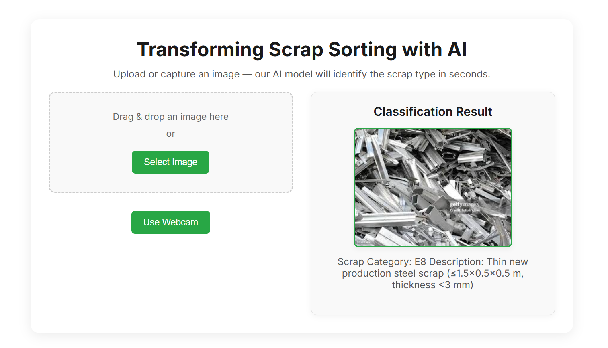

# ScrapInspectionViT-FastAPI-6C102k

 <!-- Replace with actual screenshot if available -->

**ScrapInspectionViT-FastAPI-6C102k** is a state-of-the-art machine learning solution designed to advance sustainable practices in the steel industry through precise scrap classification. By fine-tuning a Vision Transformer (ViT-Base-Patch16-224) model on the Dataset of European Scrap Classes (DOES), which includes 102,000 high-quality images across six scrap categories, this project achieves an impressive 99.56% accuracy. Leveraging Low-Rank Adaptation (LoRA) for efficient training, the model is deployed via a FastAPI web application, providing a user-friendly interface for real-time scrap sorting. This approach enhances recycling efficiency, reduces waste, and supports greener steel production.

## Table of Contents
- [Project Overview](#project-overview)
- [Features](#features)
- [Repository Structure](#repository-structure)
- [Installation](#installation)
- [Usage](#usage)
- [Model Details](#model-details)
- [Contributing](#contributing)
- [License](#license)
- [Acknowledgments](#acknowledgments)

## Project Overview
The steel industry is under increasing pressure to adopt sustainable methods, necessitating advanced solutions for scrap sorting to improve recycling and minimize waste. Traditional sorting techniques struggle with the variability and complexity of scrapyard conditions. This project addresses these challenges by fine-tuning a Vision Transformer (ViT) model on the Dataset of European Scrap Classes (DOES), containing 102,000 images captured by drones and smartphones in diverse scrapyard settings. The model classifies scrap into six categories—E1, E2, E3, E6, E8, and EHRB—with 99.56% accuracy. Using Low-Rank Adaptation (LoRA) for efficient fine-tuning, the system is deployed through a FastAPI web interface, enabling seamless image uploads or webcam captures for instant classification results. This solution bridges research and practical application, promoting scalability and sustainability in steel recycling.

## Features
- **Exceptional Accuracy**: Achieves 99.56% classification accuracy across six scrap categories.
- **Efficient Training**: Utilizes LoRA to reduce computational demands without sacrificing performance.
- **Real-Time Classification**: FastAPI web app delivers instant scrap identification.
- **Intuitive Interface**: Supports drag-and-drop image uploads and webcam capture for ease of use.
- **Sustainability Focus**: Enhances recycling processes, contributing to eco-friendly steel production.

## Repository Structure
```
ScrapInspectionViT-FastAPI-6C102k/
├── static/
│   └── style.css           # CSS styles for the web interface
├── templates/
│   └── index.html         # HTML template for the FastAPI web application
├── main.py                # FastAPI application with model inference logic
├── requirements.txt       # Python dependencies for the project
└── .gitignore             # Git ignore file for excluding unnecessary files
```

## Installation

### Prerequisites
- Python 3.8+
- Git
- A CUDA-compatible GPU (optional, for faster inference)

### Steps
1. **Clone the Repository**:
   ```bash
   git clone https://github.com/<your-username>/ScrapInspectionViT-FastAPI-6C102k.git
   cd ScrapInspectionViT-FastAPI-6C102k
   ```

2. **Set Up a Virtual Environment**:
   ```bash
   python -m venv venv
   source venv/bin/activate  # On Windows: venv\Scripts\activate
   ```

3. **Install Dependencies**:
   ```bash
   pip install -r requirements.txt
   ```

## Usage

### Launch the FastAPI Server:
```bash
uvicorn main:app --host 0.0.0.0 --port 5050
```

### Access the Web Interface:
- Open your browser and navigate to `http://localhost:5050`.
- Drag and drop an image, select an image file, or use the webcam to capture a scrap photo.
- View the classification result, showing the scrap category (e.g., E8) and its description.

### Example Output:
```
Category: Scrap Category: E8
Description: Thin new production steel scrap (≤1.5x0.5x0.5 m, thickness <3 mm)
```

## Model Details
- **Architecture**: Vision Transformer (ViT-Base-Patch16-224)
- **Dataset**: Dataset of European Scrap Classes (DOES), 102,000 images
- **Classes**: E1, E2, E3, E6, E8, EHRB
- **Fine-Tuning**: Low-Rank Adaptation (LoRA) for resource-efficient training
- **Accuracy**: 99.56% on the test set
- **Model Source**: Fine-tuned on `iDharshan/vit-base-patch16-224-SIViT` (Hugging Face)

> ⚠️ **Note**: The fine-tuned model weights are not included in this repository due to their size. Refer to the huggingface repository or contact the maintainers for access to the model weights.

## Contributing
We welcome contributions to enhance this project! To contribute:

1. Fork the repository.
2. Create a feature branch:
   ```bash
   git checkout -b feature/your-feature
   ```
3. Commit your changes:
   ```bash
   git commit -m "Add your feature"
   ```
4. Push to the branch:
   ```bash
   git push origin feature/your-feature
   ```
5. Open a pull request.

Please open an issue for bug reports or feature requests, providing detailed information.

## License
This project is licensed under the MIT License. See the `LICENSE` file for details.

## Acknowledgments
- **Dataset of European Scrap Classes (DOES)** for providing a robust and diverse dataset.
- **Hugging Face** for hosting the base model `iDharshan/vit-base-patch16-224-SIViT`.
- **FastAPI** and **Uvicorn** for enabling efficient and scalable web deployment.
- The **open-source community** for tools and libraries that made this project possible.

